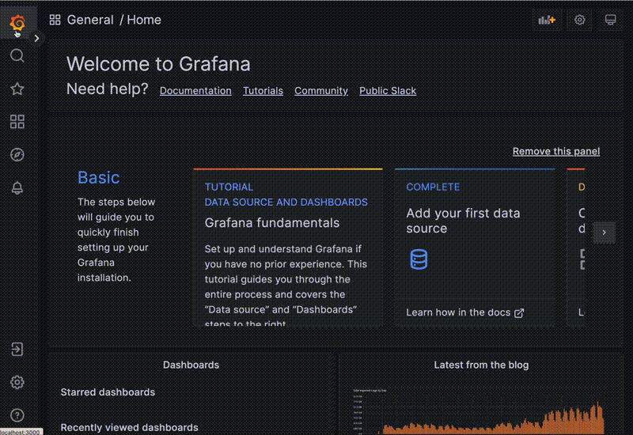

# Getting Started

## Completeness of CloudQuery data

We are using CloudQuery to collect data about how The Guardian uses:

- AWS
- GitHub
- Snyk
- Fastly
- Galaxies of the Guardian

CloudQuery generally collects metadata about these resources. That means that we have information like the name of a
repository, and when it was created, but not the contents of the files in it.

CloudQuery is only as good as the data we have, and the links between them. If you are following
DevX [best practices](https://github.com/guardian/recommendations/blob/main/best-practices.md) consistently, this
shouldn't be too much of a problem. However, if you are not, you may find that some of the data you are expecting to see
is missing, as we rely heavily on particular pieces of information to make connections between different sources.

To make sure your team's CloudQuery information is as complete as it can be, please complete as many of these steps as
is practical:

#### Everyone

- Your team email and GitHub team ID/slug
  are [up-to-date in Galaxies](https://github.com/guardian/galaxies/blob/main/shared/data/teams.ts)
    - **Link created:** Galaxies &harr; Github
    - **Reason:** We can associate business units with GitHub teams

#### Engineers

- Your repositories are administrated by the GitHub team named in Galaxies
    - **Link created:** Galaxies &harr; Github
    - **Reason:** We can associate repositories with business units
- Using the [Guardian's Snyk action](https://github.com/guardian/.github/blob/main/.github/workflows/sbt-node-snyk.yml)
  after a push to the main branch of production repositories
    - **Link created:** Snyk &harr; Github
    - **Reason:** The tags added to Snyk projects using this action are used to link them to GitHub repositories
- Using [guardian/cdk](https://github.com/guardian/cdk) to provision your infrastructure
    - **Link created:** AWS &harr; Github
    - **Reason:** Infrastructure stacks created using GuCDK are tagged with the repository that provisioned it.

Some of the CloudQuery scans run less frequently than others. You can see the schedule for each job in the CDK stack, If
you need your information quickly, prod Operations, and we will rerun the jobs on your behalf. You can find our
contact details in CloudQuery!

## Accessing CloudQuery data

The easiest way to access CloudQuery data is via [Grafana](https://metrics.gutools.co.uk/).
You can get started in the explore tab, demonstrated below



We've stored our CloudQuery data in a Postgres database, so you can use SQL to query it. _You don't have to be technical
or an engineer to be able to use SQL_. Its basic syntax is designed to be very intuitive. If you are unfamiliar with
SQL, there are lots of resources online to get you started. Julia Evans has
a [SQL playground](https://sql-playground.wizardzines.com/) to get beginners used to making simple queries.

If you're unsure of where to start, we have
an [example dashboard](https://metrics.gutools.co.uk/d/KpxfmalVz/devx-cloudquery-okr-dashboard?orgId=1&refresh=1d)
answering some common questions such as:

- What production status does a repository have
- Does the repository my stack lives in have security monitoring?
- Who owns service XYZ?

Generally, the link between one piece of information and another is via the repository. For example, if you want to know
which team owns a particular domain, you can run a query like this:

```sql
--example row: 'guardian/repo1', 'the-best-team' , 'The Best Team'
WITH repo_owners AS (SELECT github_team_repositories.full_name as repo_name
                          , github_teams.name                  as team_name
                          , github_teams.slug
                     FROM github_team_repositories
                              JOIN github_teams ON github_teams.id = github_team_repositories.team_id
                     WHERE github_team_repositories.role_name = 'admin')

--example row: 'api.example.com', 'The Best Team'
SELECT certs.domain_name
     , team_name
FROM aws_acm_certificates certs
         JOIN repo_owners ON repo_owners.repo_name = certs.tags ->>'gu:repo'

```

This query links the URL of a service to the team that owns the repository that created it. Here the key join is the
final line: `repo_owners.repo_name=certs.tags ->>'gu:repo'` which joins the repository associated with a team to the
repository associated with a stack. It allows us to generate a table of domain owners like this:

| domain_name     | team_name   |
|-----------------|-------------|
| api.example.com | Team Edward |
| example.com     | Team Jacob  |
| example.net     | Team Rocket |


