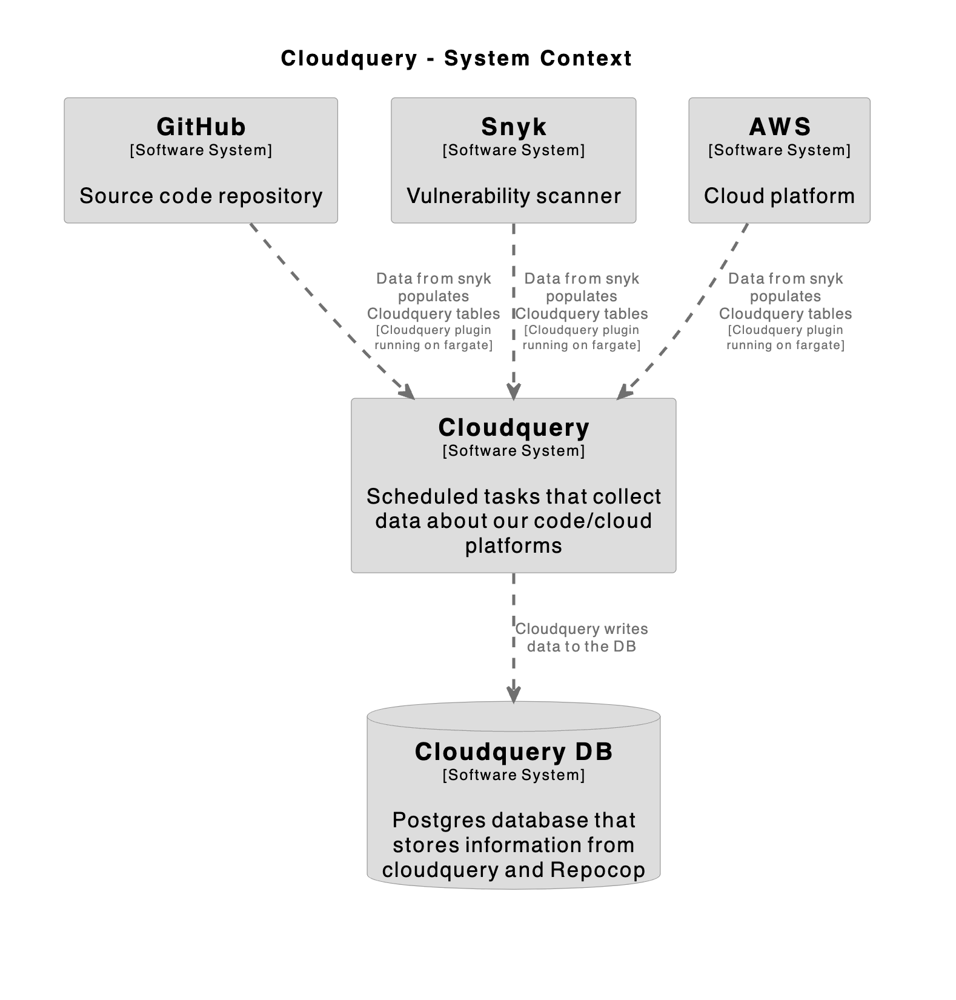

> **Warning**
> This is for local development only, and deliberately removes authentication for ease.

# CloudQuery

A small project for running [CloudQuery](https://www.cloudquery.io/) locally, using Docker.

It includes:

- CloudQuery
- Postgres
- Grafana

## Requirements

- Docker

## Setup

1. Get deployTools credentials from Janus
2. In the project root, run the following, and follow the resulting instructions:

```sh
./scripts/setup.sh
```

## Running

1. Start Docker
2. Run:

   ```sh
   npm start -w dev-environment
   ```

   OR:

   ```sh
   ./packages/dev-environment/script/start
   ```

   This will start the Docker containers, and CloudQuery will start collecting data.

3. Wait for tables to start being populated. Usually the first tables show up after a few seconds, but this could take
   as long as a minute.
4. Open Grafana on [http://localhost:3000](http://localhost:3000), and start querying the data
5. To restart on your local machine, delete the container in docker and go back to step 2.

> **Note**
> You can also use other Postgres clients, such as `psql` to query the data, or even your IDE!

## RepoCop

To develop locally once the tables have been populated follow the steps in the repocop [README](../repocop/README.md)

## Links

- [CloudQuery provided Grafana dashboards](https://github.com/cloudquery/cloudquery/tree/main/plugins/source/aws/dashboards)

## Tips and tricks

The local instance of cloudquery executes sequentially according to the order of the plugins in the config file. If
you're particularly interested in Snyk data, you can move the Snyk plugin to the top of the list in the config file, and
that data will be collected first.

If cloudquery can't detect credentials for Snyk or GitHub, it will skip those jobs. If you're not interested in GitHub
data, you don't need to generate a token. It will still collect data from other sources.

## Architecture

The architecture of the local and production CloudQuery services are very similar. The only key difference is that the production service splits the work between several fargate jobs, and locally we use one Docker container



## TODO

- Use the same configuration files as PROD?
